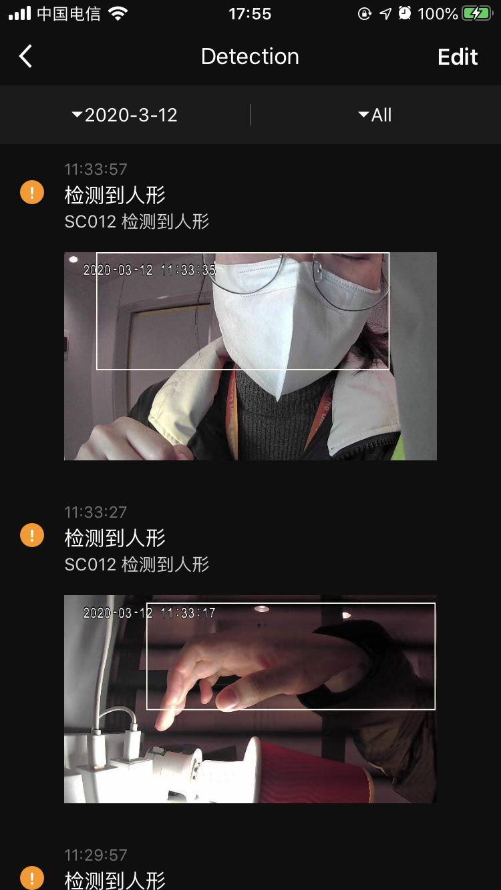

## Message-Center Panel

The camera message center panel includes all kinds of messages generated during the recording process of the camera. It is displayed by date and message type. The message category supports pictures, videos, and pure audio. It can be previewed and deleted.

**Declaration**

```objective-c
- (UIViewController *)cameraMessageCenterPanelWithDeviceModel:(TuyaSmartDeviceModel *)deviceModel;
```

**Parameter**

| Parameter   | Description          |
| ---------- | ------------------- |
| deviceModel | TuyaSmartDeviceModel |

**Example**

```objective-c
UIViewController *vc = [[TuyaSmartCameraPanelSDK sharedInstance] cameraMessageCenterPanelWithDeviceModel:deviceModel]
```

**Panel Display**

