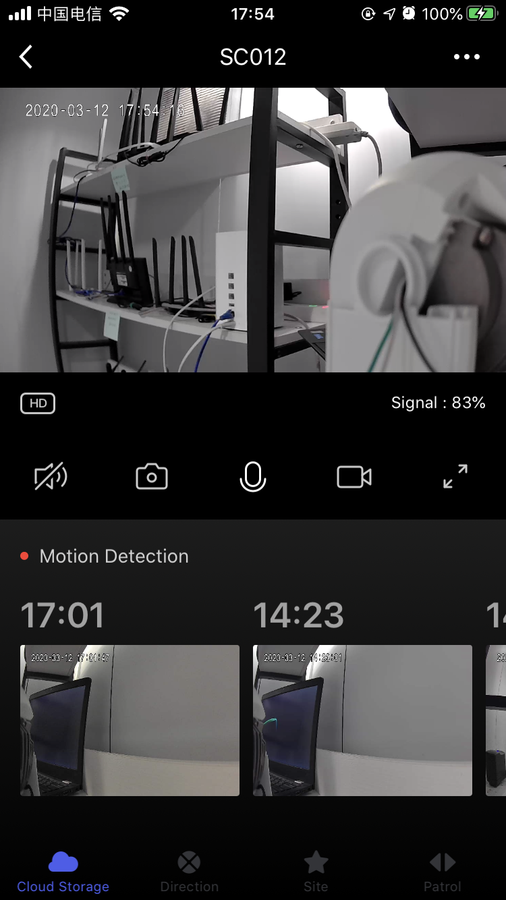

## Native Preview Panel

Camera native preview panel, including real-time video preview, sharpness switch, sound switch control, screenshot, recording, intercom and other functions, motion detection, PTZ direction control, favorite point addition / deletion, cruise control, etc.

**Declaration**

```objective-c
- (UIViewController *)cameraViewControllerWithDeviceModel:(TuyaSmartDeviceModel *)deviceModel;
```

**Parameter**

| Parameter   | Description               |
| ---------- | ------------------------ |
| deviceModel | TuyaSmartDeviceModel data |

**Example**

```objective-c
UIViewController *vc = [[TuyaSmartCameraPanelSDK sharedInstance] cameraViewControllerWithDeviceModel:deviceModel]
```

**Panel Display**

