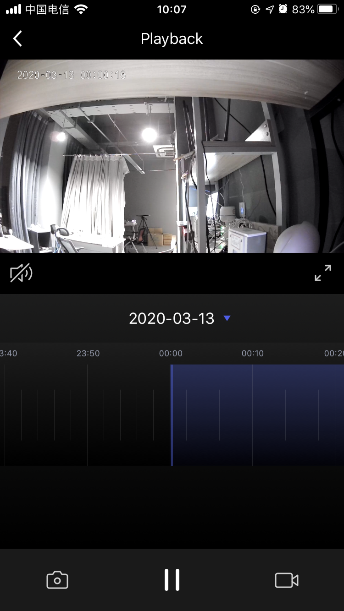

## Playback Panel

The camera playback panel displays the video saved on the camera storage device, including video playback, playback date selection, video drag and play with time axis, play / pause, sound control, screenshot, recording and other functions.

**Declaration**

```objective-c
- (UIViewController *)cameraNewPlayBackPanelWithDeviceModel:(TuyaSmartDeviceModel *)deviceModel;
```

**Parameter**

| Parameter   | Description               |
| ---------- | ------------------------ |
| deviceModel | TuyaSmartDeviceModel data |

**Example**

```objective-c
UIViewController *vc = [[TuyaSmartCameraPanelSDK sharedInstance] cameraNewPlayBackPanelWithDeviceModel:deviceModel]
```

**Panel Display**

