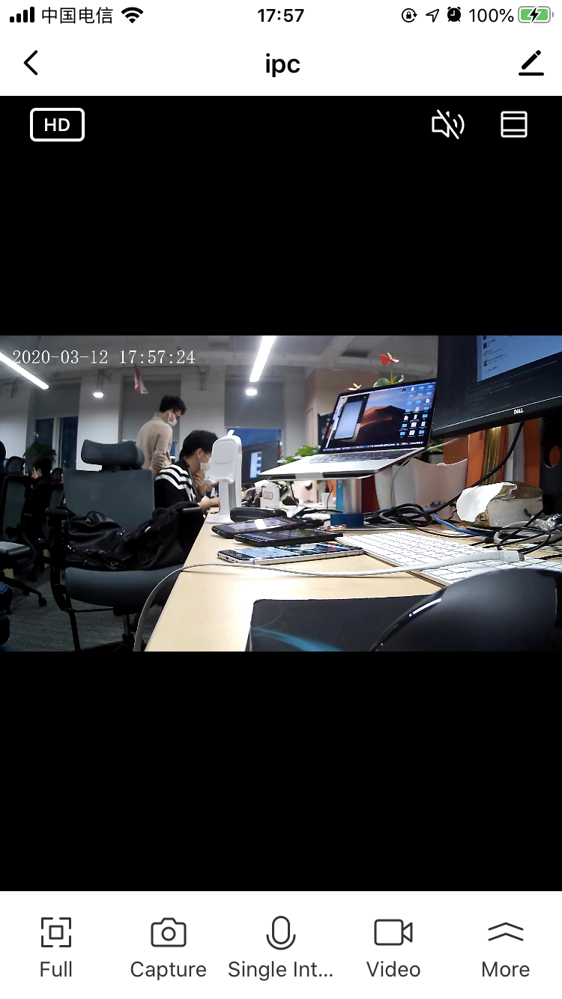

## ReactNative Preview Panel

Camera RN preview panel, packaged in TuyaPanelSDK, refer to [TuyaPanelSDK](https://tuyainc.github.io/tuyasmart_panel_ios_sdk_doc/en/).

**Declaration**

```objective-c
- (void)gotoPanelViewControllerWithDevice:(nonnull TuyaSmartDeviceModel *)device
                               completion:(void (^ _Nullable)(NSError *_Nullable error))completion;
```

**Parameter**

| Parameter   | Description          |
| ---------- | ------------------- |
| deviceModel | TuyaSmartDeviceModel |

**Example**

```objective-c
[TuyaSmartPanelSDK sharedInstance].homeId = deviceMode.homeId;
    [[TuyaSmartPanelSDK sharedInstance] gotoPanelViewControllerWithDevice:deviceMode completion:nil];
```

**Panel Display**

