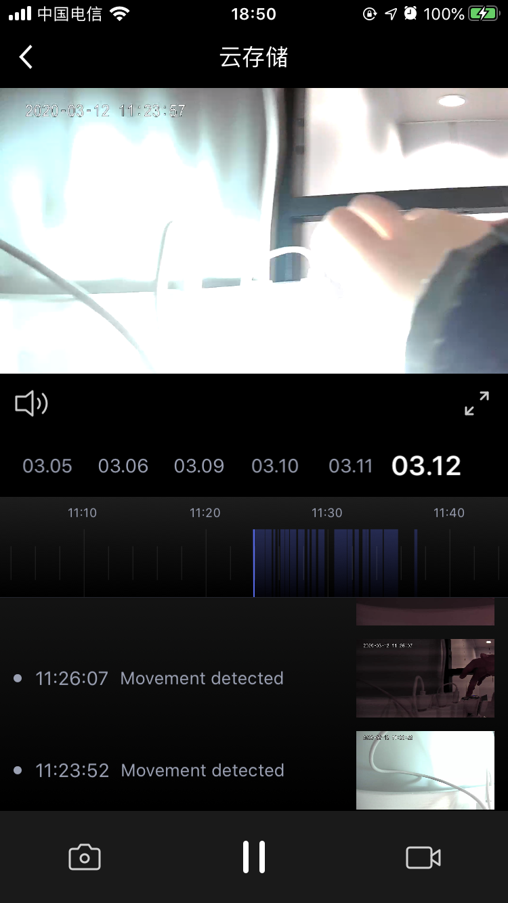

## 云存储面板

摄像机云存储面板，展示开通云存储功能之后录制保存的云端视频。包括视频云存储播放，云存储日期选择，视频随时间轴拖动播放，播放/暂停，声音控制，截图，录制等功能，移动侦测数据列表展示。

**接口说明**

```objective-c
- (UIViewController *)cameraCloudStoragePanelWithDeviceModel:(TuyaSmartDeviceModel *)deviceModel;
```

**参数说明**

| 参数        | 说明                      |
| ---------- | ------------------------ |
| deviceModel | TuyaSmartDeviceModel 数据 |

**示例代码**

```objective-c
UIViewController *vc = [[TuyaSmartCameraPanelSDK sharedInstance] cameraCloudStoragePanelWithDeviceModel:deviceModel]
```

**面板示意图**



