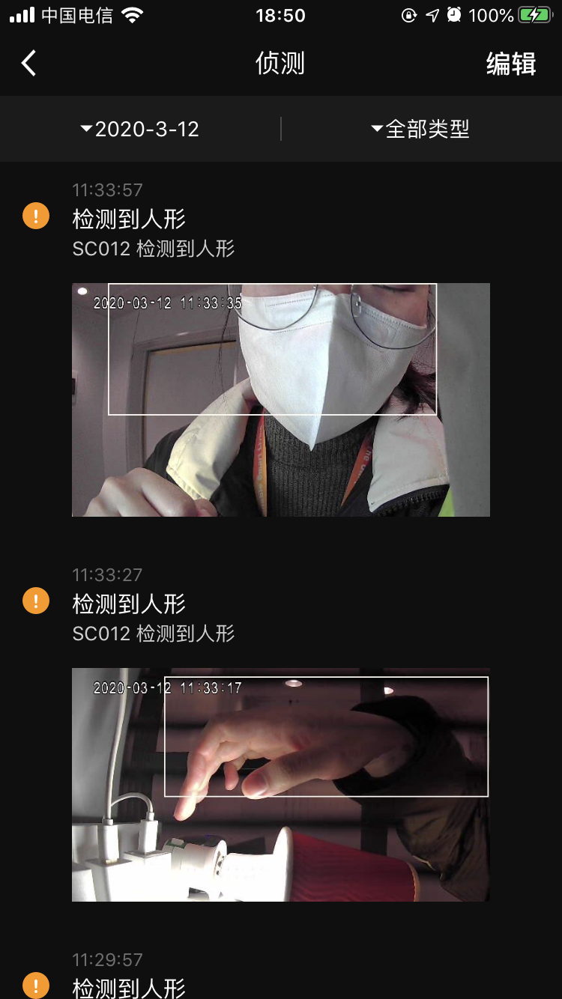

## 消息中心面板

摄像机消息中心面板，包括摄像机录制过程中产生的各类消息，按日期，消息类型进行展示，消息类别支持图片，视频，纯音频等，可进行预览及单条删除，全部删除操作。

**接口说明**

```objective-c
- (UIViewController *)cameraMessageCenterPanelWithDeviceModel:(TuyaSmartDeviceModel *)deviceModel;
```

**参数说明**

| 参数        | 说明                      |
| ---------- | ------------------------ |
| deviceModel | TuyaSmartDeviceModel 数据 |

**示例代码**

```objective-c
UIViewController *vc = [[TuyaSmartCameraPanelSDK sharedInstance] cameraMessageCenterPanelWithDeviceModel:deviceModel]
```

面板示意图**

