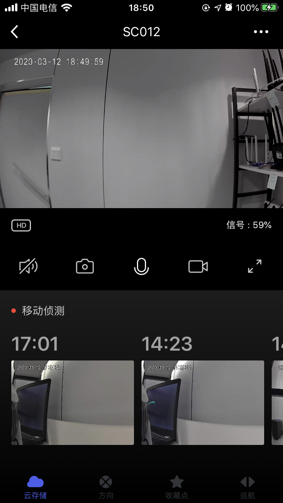

## Native 预览面板

摄像机原生预览面板，包括视频实时预览，清晰度切换，声音开关控制，截图，录制，对讲等功能，移动侦测，PTZ 方向控制，收藏点添加/删除，巡航控制等。

**接口说明**

```objective-c
- (UIViewController *)cameraViewControllerWithDeviceModel:(TuyaSmartDeviceModel *)deviceModel;
```

**参数说明**

| 参数        | 说明                      |
| ---------- | :------------------------ |
| deviceModel | TuyaSmartDeviceModel 数据 |

**示例代码**

```objective-c
UIViewController *vc = [[TuyaSmartCameraPanelSDK sharedInstance] cameraViewControllerWithDeviceModel:deviceModel]
```

**面板示意图**

