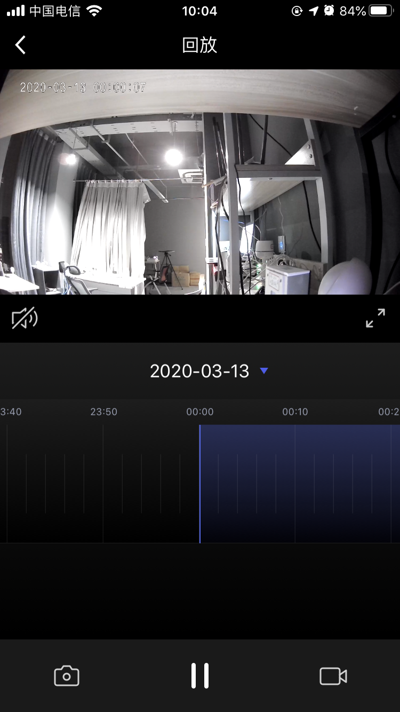

## 回放面板

摄像机回放面板，展示的是保存在摄像机存储设备上的视频，包括视频回放，回放日期选择，视频随时间轴拖动播放，播放/暂停，声音控制，截图，录制等功能。

**接口说明**

```objective-c
- (UIViewController *)cameraNewPlayBackPanelWithDeviceModel:(TuyaSmartDeviceModel *)deviceModel;
```

**参数说明**

| 参数        | 说明                      |
| ---------- | ------------------------ |
| deviceModel | TuyaSmartDeviceModel 数据 |

**示例代码**

```objective-c
UIViewController *vc = [[TuyaSmartCameraPanelSDK sharedInstance] cameraNewPlayBackPanelWithDeviceModel:deviceModel]
```

**面板示意图**

