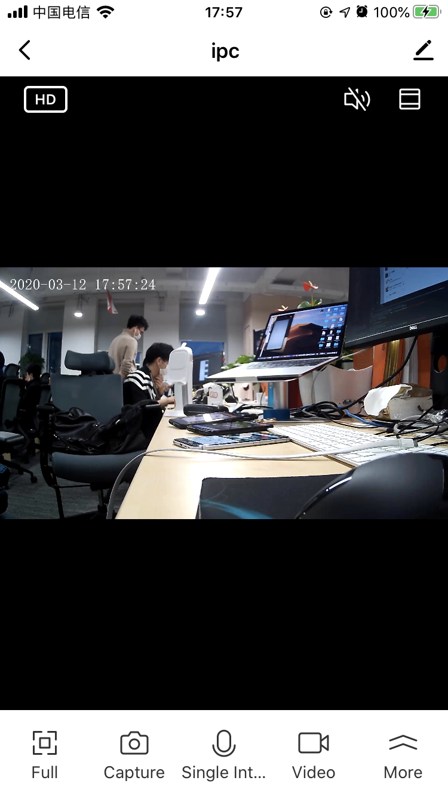

## RN预览面板

摄像机 RN 预览面板，封装在 TuyaPanelSDK 里面，参考 [Tuya Smart Panel SDK 集成文档](https://tuyainc.github.io/tuyasmart_panel_ios_sdk_doc/)

**接口说明**

```objective-c
- (void)gotoPanelViewControllerWithDevice:(nonnull TuyaSmartDeviceModel *)device
                               completion:(void (^ _Nullable)(NSError *_Nullable error))completion;
```

**参数说明**

| 参数        | 说明                      |
| ---------- | :------------------------ |
| deviceModel | TuyaSmartDeviceModel 数据 |

**示例代码**

```objective-c
[TuyaSmartPanelSDK sharedInstance].homeId = deviceMode.homeId;
    [[TuyaSmartPanelSDK sharedInstance] gotoPanelViewControllerWithDevice:deviceMode completion:nil];
```

**面板示意图**

