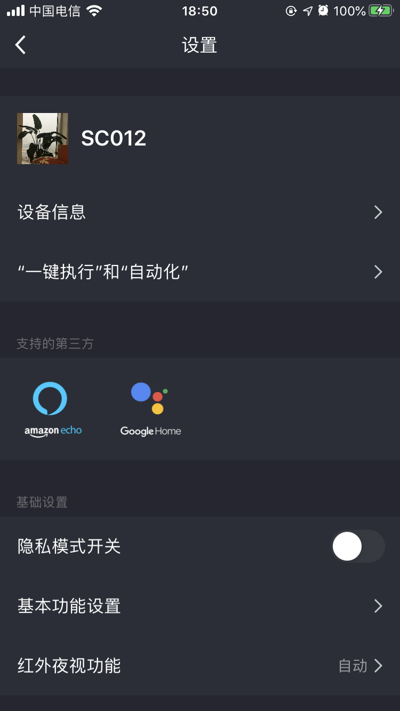

## 设置面板

摄像机设置面板，可通过后台 dp 点配置展示 [TuyaCameraSDK 开发文档 - 设备功能](https://tuyainc.github.io/tuyasmart_camera_android_sdk_doc/zh-hans/resource/camera_device_points)，主要包含：

- 设备图标/名称
- 设备信息（所有者，ip 地址，设备 id，设备时区，信号强度等）
- 基础设置（隐私开关， 基本功能设置，红外夜视功能，画质调节 (亮度,对比度)，工作模式等）
- 高级设置（侦测报警设置，PIR 开关，电源管理设置，铃铛设置，蜂鸣器调节，视频布局，预支点设置等）
- 存储设置（sd 卡容量管理，格式化等）
- 增值服务（云存储购买等）
- 离线提醒
- 其他（常见问题反馈）
- 重启设备
- 移除设备


**接口说明**

```objective-c
- (UIViewController *)cameraSettingPanelWithDeviceModel:(TuyaSmartDeviceModel *)deviceModel;
```

**参数说明**

| 参数        | 说明                      |
| ---------- | ------------------------ |
| deviceModel | TuyaSmartDeviceModel 数据 |

**示例代码**

```objective-c
UIViewController *vc = [[TuyaSmartCameraPanelSDK sharedInstance] cameraSettingPanelWithDeviceModel:deviceModel]
```

**面板示意图**

